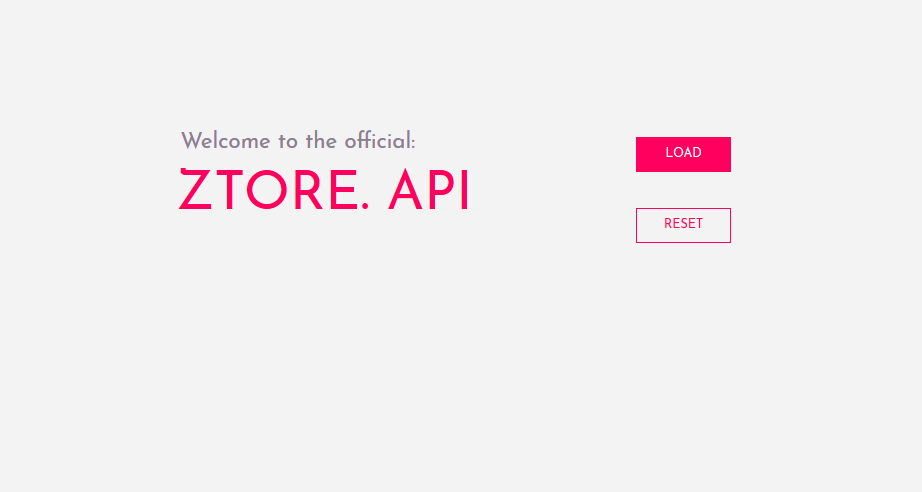

<!-- https://raw.githubusercontent.com/dbader/readme-template/master/README.md -->
# Ztore - Online Mall
> Ztore is a functional prototype for an online shopping mall. 

## ABOUT
This is only the Back End of "Ztore" to make it functional you also  need to deploy [Ztore](https://github.com/DigitalVilla/Ztore). 

* JDBC to MYSQL database
* Connection pool pattern.
* REST API server in Jersey/Java
* JSON connection with front end

### Setup
* Load "resources/dbScript.sql" into MYSQL.
* Import all the libraries from resources/jersey.
* Change the login credentials in WEB/META-INF/context.xml to your username and password.

### Instructions
* Select LOAD to insert the 6 Ztore's items into the database
* Select RESET to empty the database. it  will only keep the users.
##### Warning: Beware of CORS! :D

